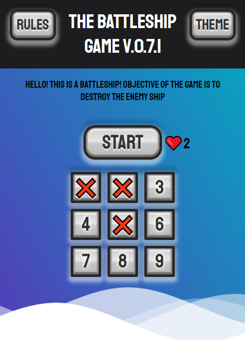

# ⚓ The Battleship Game ⚓

Press [here](https://foxcaulfield.github.io/the-battleship-game/) to play this game (also available on smartphones 📱)

This application is based on React library with using:

- "classnames"
- "react-redux"
- "react-scripts"
- "redux"
- "styled-components"

## Rules and features

- Guess where the ship is by pressing a buttons 😀 😋 🤔
- Red mark causes miss ❌
- You have 5 attempts ❤️
- You can change theme by pressing **Theme** button 🎨
- To read extended rules push **Rules** button 📖

